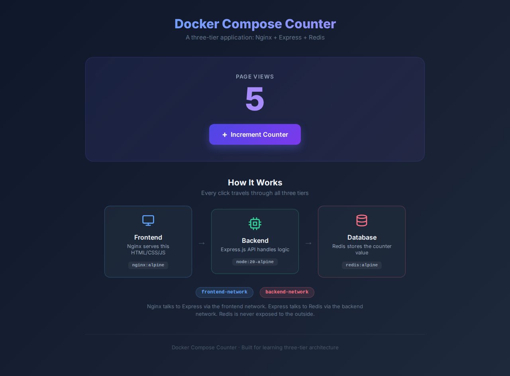

# Docker Compose Counter - Learn Three-Tier Architecture

> **Hands-on exercise**: Build a page view counter using Nginx, Express, and Redis to understand how Docker Compose orchestrates multi-container applications with network isolation.



## What You'll Learn

- [ ] Creating a `docker-compose.yml` for a three-service application
- [ ] Writing a Dockerfile for a Node.js backend
- [ ] Configuring Nginx as a reverse proxy
- [ ] Network isolation: separating frontend and backend networks
- [ ] Service discovery between containers
- [ ] Data persistence with Redis volumes

## Prerequisites

- Docker and Docker Compose installed ([install guide](https://docs.docker.com/get-docker/))
- Completed a basic Docker exercise (you should know how to write a Dockerfile)
- No Node.js knowledge required - the app code is provided

## Getting Started

```bash
git clone https://github.com/CarmitHaas/docker-compose-counter.git
cd docker-compose-counter
```

## The App

This is a page view counter built as a **three-tier application**:

```
User -> Nginx (port 80) -> Express API (port 3000) -> Redis (port 6379)
         [frontend]           [backend]                  [database]
```

- **Nginx** serves the static HTML/CSS/JS and proxies `/api/` requests to the backend
- **Express.js** handles API logic (get count, increment count)
- **Redis** stores the counter value persistently

**Take a look at the code before starting:**

- `frontend/` - Static HTML, CSS, and JavaScript served by Nginx
- `backend/server.js` - Express API with Redis connection (note how it connects to Redis using environment variables)
- `nginx/nginx.conf` - Nginx configuration that proxies API requests

## Your Mission

**Create a `docker-compose.yml`** and a **backend `Dockerfile`** that wire all three services together.

When you're done:
1. `docker compose up -d` starts all three services
2. Opening http://localhost shows the counter UI
3. Clicking "Increment Counter" increases the count (the request flows through all three tiers)
4. The count persists after restarting containers

## Think About...

- Which services need to talk to each other? Does Nginx need to reach Redis directly?
- **Network isolation**: Can you create two networks - one for Nginx-to-Express communication, and another for Express-to-Redis? This way, Redis is never accessible from the frontend network.
- Which service should expose a port to the host? (Hint: only one needs to)
- How does Nginx know where to find the backend? (Check `nginx/nginx.conf`)
- How does the backend know where to find Redis? (Check `backend/server.js` for environment variables)
- **Looking ahead**: This separation of networks mirrors real production architectures. In the cloud, your database should never be directly accessible from the internet - only your backend should reach it.

## Hints

<details>
<summary>Hint 1: Three services</summary>

Your `docker-compose.yml` needs three services:
- `nginx` - uses `image: nginx:alpine`, maps port 80
- `backend` - builds from `./backend`, does NOT expose any port to the host
- `db` - uses `image: redis:alpine`, also no host port

Only Nginx needs `ports:` because it's the entry point. The backend and database communicate internally.

</details>

<details>
<summary>Hint 2: Backend Dockerfile</summary>

The backend is a Node.js app. Your `backend/Dockerfile` should:
1. Use `node:20-alpine` as the base image
2. Copy `package*.json` first and run `npm install` (layer caching!)
3. Copy `server.js`
4. Expose port 3000
5. Run `node server.js`

</details>

<details>
<summary>Hint 3: Volumes and mounts</summary>

You need two types of volumes:

**Bind mounts** (for development):
- Mount `./nginx/nginx.conf` into Nginx at `/etc/nginx/conf.d/default.conf`
- Mount `./frontend` into Nginx at `/usr/share/nginx/html`

**Named volume** (for persistence):
- Mount a named volume to `/data` on the Redis service

</details>

<details>
<summary>Hint 4: Network isolation</summary>

Create two networks:
- `frontend-network` - connects Nginx and the backend (so Nginx can proxy to Express)
- `backend-network` - connects the backend and Redis (so Express can query Redis)

The backend joins BOTH networks. Nginx only joins the frontend network. Redis only joins the backend network.

This means Nginx cannot reach Redis directly - traffic must go through the backend.

```yaml
networks:
  frontend-network:
  backend-network:
```

</details>

<details>
<summary>Hint 5: Service configuration details</summary>

For the Nginx service:
```yaml
nginx:
  image: nginx:alpine
  ports:
    - "80:80"
  volumes:
    - ./nginx/nginx.conf:/etc/nginx/conf.d/default.conf
    - ./frontend:/usr/share/nginx/html
  depends_on:
    - backend
  networks:
    - frontend-network
```

The backend needs `REDIS_HOST=db` as an environment variable and should be on both networks.

</details>

## Verify It Works

You'll know you've succeeded when:

1. `docker compose up -d` starts three containers
2. `docker compose ps` shows all three running
3. http://localhost shows the counter UI with the dark dashboard theme
4. Clicking "Increment" increases the counter (check browser network tab - you should see POST to `/api/views`)
5. The architecture diagram at the bottom shows the three tiers

### Test the network isolation:

```bash
# Try to ping Redis from the Nginx container - should FAIL
docker compose exec nginx ping db

# Try to ping the backend from Nginx - should SUCCEED
docker compose exec nginx ping backend

# Try to ping Redis from the backend - should SUCCEED
docker compose exec backend ping db
```

### Test persistence:

```bash
docker compose down
docker compose up -d
# Counter value should still be there!
```

## Key Takeaways

- **Three-tier architecture** (frontend/backend/database) is the standard pattern for web applications
- **Nginx as a reverse proxy** serves static files directly and forwards API requests to the backend - this is how most production apps are deployed
- **Network isolation** is a security best practice: your database should only be reachable from the backend, never from the frontend or the internet
- **Docker Compose** makes this complex setup trivial - defining three services, two networks, and a volume in a single YAML file
- The `depends_on` directive ensures services start in the right order

## Solution

Ready to check your work?

```bash
git checkout solution
```

## Bonus Challenges

1. **Check the logs**: Run `docker compose logs backend` - can you see the API requests flowing through?
2. **Scale the backend**: Try `docker compose up --scale backend=2`. What happens? Does Nginx automatically load-balance?
3. **Add environment variables**: Make the Redis host configurable via `docker-compose.yml` environment variables
4. **Add healthchecks**: Add a `healthcheck` for each service in the compose file

---

*[Carmit Haas](https://github.com/CarmitHaas) | DevOps Engineer & Lead Instructor*
